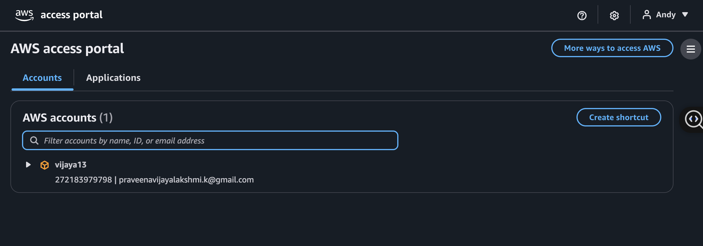
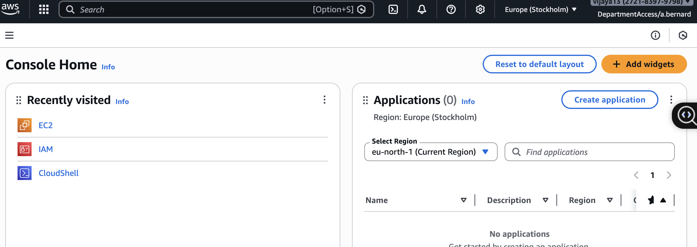

# AWS IAM & SSO Management with terraform

## Overview
This demo demonstrates how to manage AWS IAM users, groups, and group memberships using Terraform and a CSV file as the data source.
AWS SSO and Terraform Implementation Guide
1. User Creation in Identity Store

    - Process: Users are defined in Terraform using the `aws_identitystore_user`      resource.

   - Naming Convention: Implemented logic to generate usernames like `a.bernard` from first and last name inputs.

   - Attributes: Configured `display_name`, `user_name`, and contact information (email/phone).

2. Group Management

  - Creation: Used `aws_identitystore_group` to create logical collections of users (e.g., "DepartmentAccess").

  -  Membership: Associated users to groups using `aws_identitystore_group_membership` to simplify permission management.

3. Permission Sets (SSO Policies)

   - Definition: Created `aws_ssoadmin_permission_set` which acts as a template for permissions within the SSO instance.

   - Policy Attachment: Linked AWS Managed Policies (like `AdministratorAccess` or `ReadOnlyAccess`) to these sets using `aws_ssoadmin_managed_policy_attachment`.

   - Session Duration: Configured the length of time a user remains logged in.

4. Account Assignment

   - The Bridge: Connected the User/Group to a specific AWS Account ID using `aws_ssoadmin_account_assignment`.

   - Targeting: Specified the target account, the principal (User or Group), and the Permission Set to grant access.

5. Authentication & Access Portal

  - Portal URL: Users access resources via a unique Start URL (e.g., `https://. d-9066016bbd.awsapps.com/start`).

  - MFA: Enabled Multi-Factor Authentication requirements for first-time login security.

  - Identity vs. IAM: Established that SSO users are federated and do not use the standard IAM login page.

6. Troubleshooting & Validation

  - Verification: Confirmed access by launching resources (EC2) and inspecting IAM policies from the SSO-federated role.

   - Common Fixes: Resolved "Something doesn't compute" errors by using fresh Incognito sessions and ensuring correct portal URLs.


## Quick Start 
### 1. Creation of Backend Bucket for storing the terraform lock file
```hcl
terraform {
   backend s3 {
        bucket = "my-tf-state-bucket-vijaya"
        key    = "terraform.tfstate"
        region = "us-east-1"
    }
}
```

main.tf 

```hcl
# Reads users from CSV 
locals {
    users = csvdecode(file("users.csv"))
}


# Get AWS Account ID
data "aws_caller_identity" "current" {}

```
providers.tf

```hcl
provider "aws" {
  region = "us-east-1" # You can change this to your preferred region
}
```

iam.tf

```hcl
# Create IAM users based on the CSV file
resource "aws_iam_user" "users" {
    for_each = { for user in local.users : user.first_name => user }
    name = lower("${substr(each.value.first_name,0,1)}.${each.value.last_name}")
    path = "/users/"

    tags = {
        "DisplayName" = "${each.value.first_name} ${each.value.last_name}"
        "Department" = each.value.department
        "JobTitle"   = each.value.job_title  
    }
}
# Create IAM groups based on the CSV file
resource "aws_iam_group" "departments" {
    for_each = toset([for user in local.users : user.department])
    name = replace(each.key, " ", "-") # Replace spaces with hyphens for group names
    path = "/groups/"
}

# Add users to their respective department groups
resource "aws_iam_group_membership" "dept_membership" {
    for_each = toset([for user in local.users : user.department])
    name = "${each.value}-membership"
    group = aws_iam_group.departments[each.value].name
    users = [for user in local.users : lower("${substr(user.first_name,0,1)}.${user.last_name}") if user.department == each.value]

}

# Create login profiles for each user
resource "aws_iam_user_login_profile" "users" {
  for_each = aws_iam_user.users
  user = each.value.name
  password_reset_required = true   
  lifecycle {
    ignore_changes = [
        password_length,
        password_reset_required
    ]
  }              
}

# Attach the Force MFA policy to all users
resource "aws_iam_group_policy_attachment" "force_mfa_attachment" {
    for_each = aws_iam_group.departments
    group = each.value.name
    policy_arn = aws_iam_policy.force_mfa.arn
}

# This resource doesn't have many arguments; it just tells AWS to be ready to generate reports
resource "aws_iam_account_alias" "alias" {
  account_alias = "my-company-production-iam" # Give your login URL a clean name
}

```
iam-policy.tf 
```hcl
resource "aws_iam_policy" "force_mfa" {
  name        = "Force-MFA-Policy"
  path        = "/"
  description = "Allows users to manage their own MFA and denies everything else without MFA"

  policy = jsonencode({
    Version = "2012-10-17"
    Statement = [
      {
        Sid    = "AllowViewAccountInfo"
        Effect = "Allow"
        Action = [
          "iam:GetAccountPasswordPolicy",
          "iam:GetAccountSummary",
          "iam:ListVirtualMFADevices"
        ]
        Resource = "*"
      },
      {
        Sid    = "AllowManageOwnMFA"
        Effect = "Allow"
        Action = [
          "iam:CreateVirtualMFADevice",
          "iam:DeleteVirtualMFADevice",
          "iam:EnableMFADevice",
          "iam:ResyncMFADevice",
          "iam:ListMFADevices"
        ]
        # Only allow them to manage their own MFA device
        Resource = [
         "arn:aws:iam::*:mfa/$${aws:username}",
         "arn:aws:iam::*:user/*$${aws:username}"
        ]
      },
      {
        Sid    = "DenyAllExceptMFAMgmtIfNoMFA"
        Effect = "Deny"
        # Everything EXCEPT these actions is denied if MFA is missing
        NotAction = [
          "iam:CreateVirtualMFADevice",
          "iam:EnableMFADevice",
          "iam:ListVirtualMFADevices",
          "iam:ListMFADevices",
          "iam:ResyncMFADevice",
          "iam:ChangePassword",
          "sts:GetSessionToken",
          "iam:GetUser",
          "iam:GetAccountPasswordPolicy",            
          "iam:ChangePassword",
          "iam:CreateServiceLinkedRole", 
          "sso:*",      
          "sts:GetSessionToken"

        ]
        Resource = "*"
        Condition = {
          BoolIfExists = {
            "aws:MultiFactorAuthPresent" = "false"
          }
        }
      }
    ]
  })
}

# Set a strict password policy for the AWS accountß
resource "aws_iam_account_password_policy" "strict" {
  minimum_password_length        = 14
  require_lowercase_characters   = true
  require_numbers                = true
  require_uppercase_characters   = true
  require_symbols                = true
  allow_users_to_change_password = true
  password_reuse_prevention = 5
  max_password_age = 90
}
```
secret.tf 

```hcl


# Create a Secrets Manager secret to store user passwords
resource "aws_secretsmanager_secret" "user_passwords"{
   for_each = aws_iam_user.users
   name = "iam/initial-passwords/${each.value.name}"

   # for testing purposes, we can set a short recovery window. In production, you might want to set this to a longer period or disable it entirely.
   recovery_window_in_days = 0 
}
# Store the password generated by the login profile in the secret
resource "aws_secretsmanager_secret_version" "password" {
    for_each = aws_iam_user.users
    secret_id = aws_secretsmanager_secret.user_passwords[each.key].id

    # Reference the passowrd from login profile resource
    secret_string = aws_iam_user_login_profile.users[each.key].password
}
```
sso-permissions.tf

```hcl

resource "aws_ssoadmin_permission_set" "department_access" {
  name             = "DepartmentAccess"
  description      = "Grants access to AWS resources based on department membership"
  instance_arn     = tolist(data.aws_ssoadmin_instances.sso_instances.arns)[0]
  session_duration = "PT2H"
}

resource "aws_ssoadmin_managed_policy_attachment" "department_access_attachment" {
  # Note: Check if you still want to loop by IAM groups here, 
  # usually SSO attachments are done per Permission Set.
  instance_arn       = tolist(data.aws_ssoadmin_instances.sso_instances.arns)[0]
  permission_set_arn = aws_ssoadmin_permission_set.department_access.arn
  managed_policy_arn = "arn:aws:iam::aws:policy/ReadOnlyAccess" # Example policy
}
```
sso-user-creation.tf

```hcl
resource "aws_identitystore_user" "sso_users" {
  for_each = { for u in local.users : u.first_name => u }

  identity_store_id = tolist(data.aws_ssoadmin_instances.sso_instances.identity_store_ids)[0]
  
  # Use the same logic as your IAM users: a.bernard
  user_name = lower("${substr(each.value.first_name, 0, 1)}.${each.value.last_name}")
  
  display_name = "${each.value.first_name} ${each.value.last_name}"

  name {
    given_name  = each.value.first_name
    family_name = each.value.last_name
  }
}

resource "aws_ssoadmin_account_assignment" "account_assignment" {
  for_each = aws_identitystore_user.sso_users

  instance_arn       = tolist(data.aws_ssoadmin_instances.sso_instances.arns)[0]
  permission_set_arn = aws_ssoadmin_permission_set.department_access.arn
  
  principal_id   = each.value.user_id # Correctly references the created SSO user
  principal_type = "USER"
  
  target_id   = data.aws_caller_identity.current.account_id
  target_type = "AWS_ACCOUNT"
}
```
variables.tf

```hcl
terraform {
  required_providers {
    aws = {
      source  = "hashicorp/aws"
      version = "~> 5.0"
    }
  }
}
```
outputs.tf

```hcl
output "account_id" {
    value = data.aws_caller_identity.current.account_id
}

output "user_name" {
  value = [for user in aws_iam_user.users : user.name]
}

output "department_groups" {
  value = [for group in aws_iam_group.departments : group.name] 
  
}

output "department_group_membership" {
  value = [for membership in aws_iam_group_membership.dept_membership : {
    group = membership.group
    users = membership.users
  }]
  
}

output "group_policy_mapping" {
  # This creates a map: "Sales" = "arn:aws:iam..."
  value = { for k, v in aws_iam_group_policy_attachment.force_mfa_attachment : k => v.policy_arn }
}

output "sso_user_names" {
  value = [for user in aws_identitystore_user.sso_users : user.user_name]
  
}   
```




